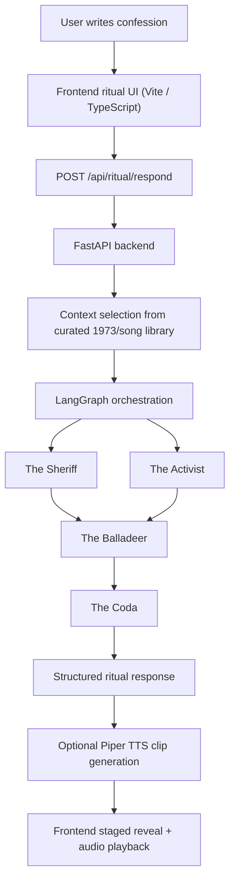

# Threshold_73

`Threshold_73` is an interactive AI artwork built for the `KNOCK / Design Your Door` assignment in `CSE 358 Introduction to Artificial Intelligence`.

The project stages Bob Dylan's `Knockin' on Heaven's Door` as a digital threshold ritual rather than a chatbot. A user brings a private confession to the room, names the role, fear, habit, grief, or old identity they are ready to set down, and the work answers through a sequence of voices shaped by `1973`, `Pat Garrett & Billy the Kid`, anti-war refusal, and the song's imagery of the badge, the guns, and the door.

## Concept

This project treats `Knockin' on Heaven's Door` as a threshold rather than a doctrine.

The work starts from the song's original cinematic context: it was written for the death scene of a sheriff in `Pat Garrett & Billy the Kid` (`1973`). From there, the project expands into the wider historical atmosphere of the period:

- the end of U.S. draft authority in `1973`
- anti-war refusal and moral exhaustion
- Dylan's plain but devastating symbolism
- the badge as a role that can no longer be worn
- the door as release from an old self rather than a literal afterlife

The result is a theatrical web experience in which AI is used as:

- a generative writer
- a voice performer
- a staging engine for multiple perspectives
- a historical filter that keeps the era alive inside the user interaction

## What The User Experiences

1. A scroll-based intro gradually places the user inside the emotional and historical world of the song.
2. The threshold chamber appears: a door, a ritual writing space, and a carefully staged atmosphere.
3. The user writes a confession or transition they are facing.
4. A radio-tuned loading sequence prepares the room.
5. Three dramatic voices answer in sequence:
   - `The Sheriff`
   - `The Activist`
   - `The Balladeer`
6. A final full-screen `Coda` appears as an ending screen and closing inscription.

## Artistic Direction

The visual and sonic language aims for:

- revisionist western dusk
- analog radio ritual
- theatrical editorial typography
- slow, intentional motion instead of generic app animation
- intimate, emotionally literate writing instead of assistant-style output

The user should feel they entered a room with memory, not a dashboard with prompts.

## AI Techniques Used

This project combines multiple AI techniques and orchestration layers:

1. `LLM-based text generation`
   - The core responses are generated by a language model through Groq or Ollama.
   - Each response is shaped by a separate persona prompt and shared context.

2. `Multi-agent orchestration`
   - LangGraph coordinates the response flow.
   - The work does not produce one monolithic answer; it stages multiple voices with distinct functions and a final coda.

3. `Context retrieval from a curated historical library`
   - The backend selects historically relevant context fragments from a curated library based on the user's confession.
   - This is a lightweight retrieval layer grounded in themes like `badge`, `draft`, `refusal`, `Pat Garrett`, and Dylan's Nobel reflections.

4. `Text-to-speech synthesis`
   - Piper can generate role-specific `.wav` clips for the staged voices.
   - When Piper is unavailable, the frontend can fall back to browser-based speech.

## Why This Satisfies The Assignment's Technical Constraint

The assignment requires at least two distinct AI techniques.

`Threshold_73` uses:

- `LLM generation`
- `TTS synthesis`

and supports them with:

- `multi-agent orchestration`
- `historically-aware retrieval of context fragments`

The work is also built on original code across both frontend and backend.

## Architecture Overview



## Response Roles

### The Sheriff

- Voice of resignation, release, and the end of a role
- Anchored in the original death-scene context of the song
- Uses spare and weathered language

### The Activist

- Voice of refusal, moral pressure, and public history
- Anchored in `1973`, draft exhaustion, and anti-war energy
- Reads the user's threshold as a break from imposed duty

### The Balladeer

- Voice of lyrical synthesis and emotional afterlight
- Brings the song's meaning, the film, and the era into a more timeless register
- Serves as the last full human response before the final inscription

### The Coda

- A single closing line
- Full-screen epilogue
- Intended to feel like an inscription left in the room after the voices are gone

## Tech Stack

### Frontend

- `Vite`
- `TypeScript`
- custom CSS
- Web Audio API
- staged text typing and audio choreography

### Backend

- `FastAPI`
- `LangGraph`
- provider abstraction for `Groq`, `Ollama`, and `mock`
- optional `Piper` TTS

### Models / Providers

- `Groq` for cloud LLM inference
- `Ollama` for local LLM inference
- `Piper` for local voice generation

## Project Structure

```text
Threshold_73/
├─ backend/
│  ├─ app/
│  │  ├─ config.py
│  │  ├─ graph.py
│  │  ├─ main.py
│  │  ├─ providers/
│  │  └─ services/
│  ├─ requirements.txt
│  ├─ requirements-piper.txt
│  └─ .env.example
├─ public/
│  └─ threshold73-mark.svg
├─ src/
│  ├─ assets/
│  ├─ config.ts
│  ├─ main.ts
│  └─ style.css
├─ index.html
└─ package.json
```

## Key Files

- [C:\Users\burito\Desktop\Lectures\Projects\AI\Threshold_73\src\main.ts](</C:/Users/burito/Desktop/Lectures/Projects/AI/Threshold_73/src/main.ts>)
  Frontend scene flow, staged reveal logic, audio orchestration, API calls.

- [C:\Users\burito\Desktop\Lectures\Projects\AI\Threshold_73\src\style.css](</C:/Users/burito/Desktop/Lectures/Projects/AI/Threshold_73/src/style.css>)
  Visual language, layout, motion, atmospheric styling, coda screen.

- [C:\Users\burito\Desktop\Lectures\Projects\AI\Threshold_73\backend\app\main.py](</C:/Users/burito/Desktop/Lectures/Projects/AI/Threshold_73/backend/app/main.py>)
  FastAPI app, provider runtime selection, TTS serving, API endpoints.

- [C:\Users\burito\Desktop\Lectures\Projects\AI\Threshold_73\backend\app\graph.py](</C:/Users/burito/Desktop/Lectures/Projects/AI/Threshold_73/backend/app/graph.py>)
  LangGraph pipeline for role sequencing and coda normalization.

- [C:\Users\burito\Desktop\Lectures\Projects\AI\Threshold_73\backend\app\services\prompts.py](</C:/Users/burito/Desktop/Lectures/Projects/AI/Threshold_73/backend/app/services/prompts.py>)
  Persona prompt design and tonal constraints.

- [C:\Users\burito\Desktop\Lectures\Projects\AI\Threshold_73\backend\app\services\context_library.py](</C:/Users/burito/Desktop/Lectures/Projects/AI/Threshold_73/backend/app/services/context_library.py>)
  Curated historical fragments and selection logic.

- [C:\Users\burito\Desktop\Lectures\Projects\AI\Threshold_73\backend\app\services\tts.py](</C:/Users/burito/Desktop/Lectures/Projects/AI/Threshold_73/backend/app/services/tts.py>)
  Piper voice loading and `.wav` generation.

## Setup

### 1. Install frontend dependencies

```powershell
npm install
```

### 2. Install backend dependencies

```powershell
pip install -r backend\requirements.txt
```

### 3. Optional: install Piper support

```powershell
pip install -r backend\requirements-piper.txt
```

### 4. Create backend environment file

Copy [C:\Users\burito\Desktop\Lectures\Projects\AI\Threshold_73\backend\.env.example](</C:/Users/burito/Desktop/Lectures/Projects/AI/Threshold_73/backend/.env.example>) to `backend/.env` and fill in the values you need.

Minimal Groq example:

```env
KNOCK_MODEL_PROVIDER=groq
GROQ_API_KEY=replace_me
GROQ_MODEL=llama-3.1-8b-instant
KNOCK_CORS_ORIGIN=http://127.0.0.1:5173
KNOCK_REQUEST_TIMEOUT=90
KNOCK_TTS_PROVIDER=auto
```

### 5. Run the backend

```powershell
python -m uvicorn backend.app.main:app --reload --app-dir .
```

### 6. Run the frontend

```powershell
npm run dev -- --host 127.0.0.1
```

Frontend default:

- [http://127.0.0.1:5173](http://127.0.0.1:5173)

Backend health check:

- [http://127.0.0.1:8000/api/health](http://127.0.0.1:8000/api/health)

## Configuration Reference

### Frontend

- `VITE_API_BASE_URL`
  Default: `http://127.0.0.1:8000`

### Backend model settings

- `KNOCK_MODEL_PROVIDER`
  - `auto`
  - `groq`
  - `ollama`
  - fallback to `mock` when necessary

- `GROQ_API_KEY`
- `GROQ_MODEL`
- `KNOCK_OLLAMA_BASE_URL`
- `KNOCK_OLLAMA_MODEL`
- `KNOCK_REQUEST_TIMEOUT`

### Backend TTS settings

- `KNOCK_TTS_PROVIDER`
  - `auto`
  - `piper`
  - `none`

- `KNOCK_PIPER_VOICE_MODEL`
- `KNOCK_PIPER_VOICE_MODEL_ACTIVIST`
- `KNOCK_PIPER_VOICE_MODEL_ARCHIVIST`
- `KNOCK_PIPER_VOICE_MODEL_SYNTHESIS`
- `KNOCK_PIPER_VOLUME`
- `KNOCK_PIPER_OUTPUT_DIR`
- `KNOCK_TTS_PUBLIC_PATH`

## Current Voice Mapping

When Piper is available:

- `The Sheriff` → `en_US-norman-medium`
- `The Activist` → `en_US-arctic-medium`
- `The Balladeer` → `en_US-reza_ibrahim-medium`
- `The Coda` → `en_US-arctic-medium`

## Notes On Assets

Tracked assets that are intentionally part of the experience:

- `src/assets/Radio Tuning sound effect.mp3`
- `src/assets/clunk tape button.mp3`
- `public/threshold73-mark.svg`

Ignored generated or local-only files include:

- `backend/generated_audio/`
- log files
- local environment files
- local model weights such as `.onnx`

## Historical Context Embedded In The Work

This project does not use the song as decoration.

It is structurally shaped by:

- the dying sheriff in `Pat Garrett & Billy the Kid`
- the `badge` as burden, role, and identity
- the `guns` as defense, habit, and violence laid down
- the anti-war exhaustion of `1973`
- the moral force of refusal
- Dylan's view that songs are fulfilled in hearing and performance

These historical elements appear in:

- prompt design
- context retrieval
- visual staging
- voice dramaturgy
- final inscription logic

## Known Scope

`Threshold_73` is currently strongest as:

- an exhibition demo
- a portfolio-grade interactive artwork
- a technically original hybrid of staged LLM writing, TTS, and audiovisual web design

It is not designed as:

- a productivity chatbot
- a generic journaling tool
- a large-scale retrieval system

## Related Documentation

- [C:\Users\burito\Desktop\Lectures\Projects\AI\Threshold_73\backend\README.md](</C:/Users/burito/Desktop/Lectures/Projects/AI/Threshold_73/backend/README.md>)
- [C:\Users\burito\Desktop\Lectures\Projects\AI\Threshold_73\backend\.env.example](</C:/Users/burito/Desktop/Lectures/Projects/AI/Threshold_73/backend/.env.example>)

## Credits

This project is inspired by:

- Bob Dylan, `Knockin' on Heaven's Door`
- `Pat Garrett & Billy the Kid` (`1973`)
- the wider historical and emotional atmosphere of `1973`

The code, staging, architecture, and interaction design in this repository are custom-built for this artwork.
