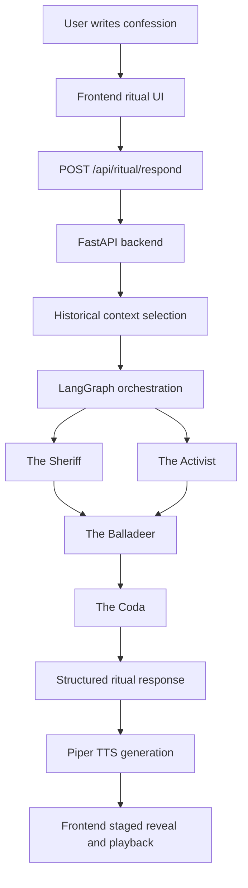

# Threshold_73

`Threshold_73` is an interactive AI artwork created for the `KNOCK / Design Your Door` creative project in `CSE 358 Introduction to Artificial Intelligence`.

It reimagines Bob Dylan's `Knockin' on Heaven's Door` not as a song to be explained, but as a threshold to be entered. The user writes a private confession into a ritual chamber, and the work answers through staged voices shaped by the song's original cinematic context, the historical mood of `1973`, and the emotional logic of laying down a role that can no longer be carried.

## Team

- `Salih Çimen` — `20230808075`
- `Arda Akıncı` — `20230808077`
- `Kerem Düz` — `20220808053`

## Brief Artistic Statement

`Threshold_73` treats `Knockin' on Heaven's Door` as a ritual of release rather than a fixed message. The project is built around one central image: the badge that can no longer be worn.

In Dylan's song, that badge belongs to a dying sheriff. In this work, it becomes any identity built from duty, expectation, usefulness, survival, obedience, or self-protection. The user is invited to name what they are ready to leave behind. The room then answers through three human-scale voices and one final inscription.

The goal is not to simulate Dylan, but to create a digital chamber in which the themes of farewell, transition, mortality, burden, and release can be felt through language, sound, motion, and interaction.

## Assignment Alignment

This repository is structured to satisfy the three mandatory constraints of the assignment.

### 1. At least 2 AI techniques

The project uses at least two distinct AI techniques:

- `LLM-based text generation`
  The Sheriff, The Activist, The Balladeer, and The Coda are generated through the `Groq` API in the active submission version of the project.

- `Text-to-speech synthesis`
  The generated text can be rendered as staged audio through `Piper`.

Supporting layers:

- `LangGraph multi-agent orchestration`
- `historical context selection` from a curated library of 1973/song-related fragments

Important note:
The project does **not** claim that multiple prompts alone count as multiple AI techniques. The two core techniques are `LLM generation` and `TTS synthesis`.

### 2. Original code

The project is built on original frontend and backend code:

- `TypeScript + Vite` for the theatrical web experience
- `Python + FastAPI + LangGraph` for orchestration and AI response flow

### 3. Historical context

The historical and cultural context of the song is not decorative. It is embedded in:

- the voice design of the agents
- the prompt architecture
- the curated context fragments
- the visual staging
- the ritual structure of the experience

The work explicitly draws from:

- `Pat Garrett & Billy the Kid` (`1973`)
- the end of U.S. draft authority in `1973`
- anti-war refusal and countercultural exhaustion
- the badge and guns imagery in the song
- Dylan's notion that songs are completed in hearing, not only on the page

## Conceptual Frame

The project begins from a simple interpretive claim:

`Knockin' on Heaven's Door` is not only about death. It is about the moment when a role reaches its limit.

That idea expands across the entire experience. The user does not fill out a form; they cross a threshold. They do not receive a single chatbot answer; they hear a council. They do not end with a summary; they receive a final coda that behaves like an inscription.

The work tries to hold together four domains at once:

- personal transition
- historical atmosphere
- poetic compression
- technical orchestration

## User Experience

1. The visitor enters through a scroll-based prologue.
2. The room gradually establishes the world of the song: death, era, threshold, and release.
3. The user arrives at the confession chamber and writes what they are ready to set down.
4. A radio-like loading ritual assembles the room.
5. Three full voices answer in sequence.
6. A final full-screen coda appears as an ending screen.

## Voice Structure

### The Sheriff

- Burden, witness, dusk
- Speaks from the song's original death-scene DNA
- Frames release as grave, honest, and necessary

### The Activist

- Refusal, pressure, fire
- Speaks from the public and political weight of `1973`
- Reads the user's threshold as a refusal of imposed duty

### The Balladeer

- Memory, afterlight, release
- Synthesizes the prior voices into a more lyrical and timeless register
- Serves as the last full human response before the coda

### The Coda

- A final inscription
- Full-screen ending scene
- Designed to leave the user with a brief, decisive line

## Technical Architecture Overview



## AI Techniques Used And How They Interact

### 1. LLM-based generation

Used for:

- role-based response writing
- historical tone shaping
- emotional interpretation of user confessions
- final coda generation

### 2. TTS synthesis

Used for:

- turning the generated responses into voiced performance
- giving each role a distinct sonic presence
- making the room feel heard rather than merely read

### 3. Orchestration layer

`LangGraph` is used to stage the order and dependency of the voices:

- Sheriff and Activist speak in parallel relation to the confession
- Balladeer hears both and responds after them
- Coda arrives only at the end

### 4. Historical context retrieval

A curated context library is consulted before generation. The selected fragments are passed into the response flow so that the era and the song's symbolic world remain active in the output.

This is a lightweight retrieval layer based on thematic relevance, not a full embedding-based RAG system.

## Project Structure

```text
Threshold_73/
├─ backend/
│  ├─ app/
│  │  ├─ config.py
│  │  ├─ graph.py
│  │  ├─ main.py
│  │  ├─ schemas.py
│  │  ├─ providers/
│  │  └─ services/
│  ├─ requirements.txt
│  ├─ requirements-piper.txt
│  ├─ .env.example
│  └─ README.md
├─ public/
│  └─ threshold73-mark.svg
├─ src/
│  ├─ assets/
│  │  ├─ Radio Tuning sound effect.mp3
│  │  └─ clunk tape button.mp3
│  ├─ config.ts
│  ├─ main.ts
│  ├─ style.css
│  └─ vite-env.d.ts
├─ ARTIST_MANIFESTO.md
├─ index.html
├─ package.json
├─ package-lock.json
└─ tsconfig.json
```

## Key Source Files

- [C:\Users\burito\Desktop\Lectures\Projects\AI\Threshold_73\src\main.ts](</C:/Users/burito/Desktop/Lectures/Projects/AI/Threshold_73/src/main.ts>)
  Main scene flow, frontend state, audio logic, typing choreography, and API calls.

- [C:\Users\burito\Desktop\Lectures\Projects\AI\Threshold_73\src\style.css](</C:/Users/burito/Desktop/Lectures/Projects/AI/Threshold_73/src/style.css>)
  Visual language, layout, motion, stage design, and full-screen coda behavior.

- [C:\Users\burito\Desktop\Lectures\Projects\AI\Threshold_73\backend\app\main.py](</C:/Users/burito/Desktop/Lectures/Projects/AI/Threshold_73/backend/app/main.py>)
  FastAPI entry point, provider selection, TTS runtime wiring, endpoint definitions.

- [C:\Users\burito\Desktop\Lectures\Projects\AI\Threshold_73\backend\app\graph.py](</C:/Users/burito/Desktop/Lectures/Projects/AI/Threshold_73/backend/app/graph.py>)
  LangGraph flow, coda normalization, and role sequencing.

- [C:\Users\burito\Desktop\Lectures\Projects\AI\Threshold_73\backend\app\services\prompts.py](</C:/Users/burito/Desktop/Lectures/Projects/AI/Threshold_73/backend/app/services/prompts.py>)
  Prompt definitions for The Sheriff, The Activist, The Balladeer, and The Coda.

- [C:\Users\burito\Desktop\Lectures\Projects\AI\Threshold_73\backend\app\services\context_library.py](</C:/Users/burito/Desktop/Lectures/Projects/AI/Threshold_73/backend/app/services/context_library.py>)
  Curated historical fragments and selection logic.

- [C:\Users\burito\Desktop\Lectures\Projects\AI\Threshold_73\backend\app\services\tts.py](</C:/Users/burito/Desktop/Lectures/Projects/AI/Threshold_73/backend/app/services/tts.py>)
  Piper loading and `.wav` clip generation.

## Installation And Setup

## Requirements

- `Node.js`
- `npm`
- `Python 3.11+` recommended
- internet connection if using `Groq`
- optional local voice models if using `Piper`

## 1. Install frontend dependencies

```powershell
npm install
```

## 2. Install backend dependencies

```powershell
pip install -r backend\requirements.txt
```

## 3. Optional: install Piper support

```powershell
pip install -r backend\requirements-piper.txt
```

## 4. Configure environment variables

Copy [C:\Users\burito\Desktop\Lectures\Projects\AI\Threshold_73\backend\.env.example](</C:/Users/burito/Desktop/Lectures/Projects/AI/Threshold_73/backend/.env.example>) to `backend/.env`.

Example:

```env
KNOCK_MODEL_PROVIDER=groq
GROQ_API_KEY=replace_me
GROQ_MODEL=llama-3.1-8b-instant
KNOCK_CORS_ORIGIN=http://127.0.0.1:5173
KNOCK_REQUEST_TIMEOUT=90

KNOCK_TTS_PROVIDER=auto
KNOCK_PIPER_VOICE_MODEL=backend/voices/en_US-norman-medium.onnx
KNOCK_PIPER_VOICE_MODEL_ACTIVIST=backend/voices/en_US-arctic-medium.onnx
KNOCK_PIPER_VOICE_MODEL_ARCHIVIST=backend/voices/en_US-reza_ibrahim-medium.onnx
KNOCK_PIPER_VOICE_MODEL_SYNTHESIS=backend/voices/en_US-reza_ibrahim-medium.onnx
KNOCK_PIPER_VOLUME=0.62
KNOCK_PIPER_OUTPUT_DIR=backend/generated_audio
KNOCK_TTS_PUBLIC_PATH=/generated-audio
```

## 5. Run the backend

```powershell
python -m uvicorn backend.app.main:app --reload --app-dir .
```

## 6. Run the frontend

```powershell
npm run dev -- --host 127.0.0.1
```

Primary local URLs:

- frontend: [http://127.0.0.1:5173](http://127.0.0.1:5173)
- backend health: [http://127.0.0.1:8000/api/health](http://127.0.0.1:8000/api/health)

## Dependencies And API Requirements

### Frontend dependencies

- `vite`
- `typescript`

### Backend dependencies

- `fastapi==0.115.12`
- `httpx==0.28.1`
- `langgraph==0.4.5`
- `uvicorn[standard]==0.34.2`

### Optional TTS dependency

- `piper-tts==1.4.2`

### API requirements

The active submission version uses:

- `groq`
  Requires `GROQ_API_KEY`

The repository also includes a `mock` fallback mode for local testing and demo-safe development, but the intended artistic pipeline is the `Groq + LangGraph + Piper` chain documented in this README.

## Configuration Reference

### Frontend

- `VITE_API_BASE_URL`
  Default: `http://127.0.0.1:8000`

### Backend model configuration

- `KNOCK_MODEL_PROVIDER`
  - `auto`
  - `groq`

- `GROQ_API_KEY`
- `GROQ_MODEL`
- `KNOCK_REQUEST_TIMEOUT`
- `KNOCK_CORS_ORIGIN`

### Backend TTS configuration

- `KNOCK_TTS_PROVIDER`
  - `auto`
  - `piper`
  - `none`

- `KNOCK_PIPER_VOICE_MODEL`
- `KNOCK_PIPER_VOICE_MODEL_ACTIVIST`
- `KNOCK_PIPER_VOICE_MODEL_ARCHIVIST`
- `KNOCK_PIPER_VOICE_MODEL_SYNTHESIS`
- `KNOCK_PIPER_VOLUME`
- `KNOCK_PIPER_OUTPUT_DIR`
- `KNOCK_TTS_PUBLIC_PATH`

## Current Voice Mapping

When `Piper` is available:

- `The Sheriff` → `en_US-norman-medium`
- `The Activist` → `en_US-arctic-medium`
- `The Balladeer` → `en_US-reza_ibrahim-medium`
- `The Coda` → `en_US-arctic-medium`

## Example Outputs

This section is included to satisfy the assignment requirement for example outputs or screenshots.

### Example confession

```text
I have spent so much time being the dependable one that I don't really know who I am without that role. Graduation is close, and instead of feeling proud, I feel tired and a little afraid. I think I'm ready to leave behind the version of me that only knows how to survive by meeting expectations.
```

### Example response structure

- `The Sheriff`
  A grave, pared-down response about the cost of carrying a role past its time.

- `The Activist`
  A sharper response that reframes the confession as refusal of obligation and inherited pressure.

- `The Balladeer`
  A more lyrical final human answer that softens the room and reframes the threshold as release.

- `The Coda`
  A single closing line in full-screen form.

### Example coda-style line

```text
You were right to leave the role; your living name remains.
```

## Historical Context Embedded In The Work

This project does not merely mention Dylan or `1973`. It builds the experience around their meanings.

The following ideas are woven into the work's structure:

- the death scene of the sheriff in `Pat Garrett & Billy the Kid`
- the badge as duty, role, institution, and exhausted identity
- the guns as defense, violence, and survival habits being set down
- `1973` as a year of draft exhaustion and anti-war moral pressure
- the threshold as release from an old form of selfhood
- the idea, from Dylan's Nobel reflections, that songs are fulfilled in hearing and performance

## Included Deliverables

This repository includes or supports all three required deliverables:

1. `The Artwork`
   The working frontend and backend experience in this repository

2. `The Artist's Manifesto`
   [C:\Users\burito\Desktop\Lectures\Projects\AI\Threshold_73\ARTIST_MANIFESTO.md](</C:/Users/burito/Desktop/Lectures/Projects/AI/Threshold_73/ARTIST_MANIFESTO.md>)

3. `The Code Repository`
   This repository, including setup instructions, architecture, technique descriptions, and source code

## Transparency And Academic Integrity

AI tools and models used in this project should be listed transparently in any final submission package.

Active runtime stack:

- `Groq` API
  Used for live `LLM-based text generation` in the interactive experience.

- `LangGraph`
  Used for `multi-agent orchestration`, response sequencing, and role dependency flow.

- `Piper`
  Used for `text-to-speech synthesis`, turning generated responses into staged voice clips.

- `Curated context selection logic`
  Used to keep the song's cinematic, symbolic, and historical references active in the generation flow.

- `Custom prompt and staging logic`
  Used to shape tone, pacing, role behavior, and the theatrical structure of the experience.

Development and production support tools:

- `OpenAI GPT-5.5`
  Used during development for implementation support, debugging, writing refinement, and iteration.

- `Claude Opus 4.6`
  Used during development for conceptual discussion, idea refinement, and critical reflection on the artistic direction of the project.

All architectural decisions, role design, visual direction, interaction flow, historical framing, and philosophical interpretation in this project are intentionally authored and curated by the team. The system generates material, but the work's meaning depends on human selection, shaping, judgment, and final artistic direction.

## Asset Notes

Tracked local assets intentionally included in the experience:

- [C:\Users\burito\Desktop\Lectures\Projects\AI\Threshold_73\src\assets\Radio Tuning sound effect.mp3](</C:/Users/burito/Desktop/Lectures/Projects/AI/Threshold_73/src/assets/Radio%20Tuning%20sound%20effect.mp3>)
- [C:\Users\burito\Desktop\Lectures\Projects\AI\Threshold_73\src\assets\clunk tape button.mp3](</C:/Users/burito/Desktop/Lectures/Projects/AI/Threshold_73/src/assets/clunk%20tape%20button.mp3>)
- [C:\Users\burito\Desktop\Lectures\Projects\AI\Threshold_73\public\threshold73-mark.svg](</C:/Users/burito/Desktop/Lectures/Projects/AI/Threshold_73/public/threshold73-mark.svg>)

Generated or local-only artifacts are ignored:

- `backend/generated_audio/`
- log files
- `.env` files
- local model files such as `.onnx`

## Related Documentation

- [C:\Users\burito\Desktop\Lectures\Projects\AI\Threshold_73\ARTIST_MANIFESTO.md](</C:/Users/burito/Desktop/Lectures/Projects/AI/Threshold_73/ARTIST_MANIFESTO.md>)
- [C:\Users\burito\Desktop\Lectures\Projects\AI\Threshold_73\backend\README.md](</C:/Users/burito/Desktop/Lectures/Projects/AI/Threshold_73/backend/README.md>)
- [C:\Users\burito\Desktop\Lectures\Projects\AI\Threshold_73\backend\.env.example](</C:/Users/burito/Desktop/Lectures/Projects/AI/Threshold_73/backend/.env.example>)

## Final Note

`Threshold_73` is designed as an answer to the assignment's core challenge: to make an AI-driven artwork that is technically real, historically grounded, aesthetically coherent, and personally meaningful.

The work is not interested in explaining the song from a distance. It is interested in building a room in which the user can hear the song's question turn toward them:

What are you finally ready to leave behind?
